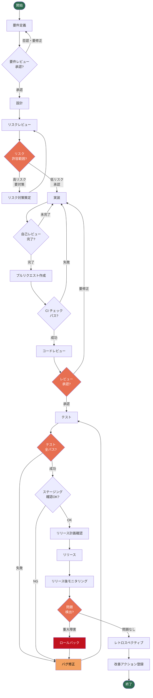
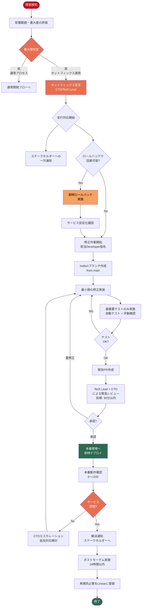

# 開発ライフサイクル定義書

## 1. 概要

### 目的

本ドキュメントは、5〜20名規模のスモールチームにおける開発ライフサイクルを定義し、一貫性・品質・スピードを両立した開発プロセスを実現することを目的とする。

### スコープ

- 対象：プロダクト開発に関わるすべての機能開発・改善・バグ修正
- 除外：緊急ホットフィックス（本ドキュメント末尾の「緊急ホットフィックスプロセス」を参照）
- 適用チーム規模：5〜20名

### 基本原則

- **小さく・頻繁に**: 大きな変更を避け、小さな単位でリリースする
- **品質を前倒しに**: テストとレビューをプロセスの早い段階に組み込む
- **透明性**: 全フェーズの進捗と判断根拠を可視化する
- **継続的改善**: レトロスペクティブの学びを次のサイクルへ反映する

---

## 2. 開発ライフサイクル全体フロー

---

## 3. 各フェーズの詳細定義

### 3.1 要件定義フェーズ

| 項目 | 内容 |
|------|------|
| **インプット** | ユーザーフィードバック、ビジネス要求、バックログアイテム |
| **アウトプット** | 承認済み要件チケット（Linear）、受け入れ基準 |
| **担当ロール** | PM（主担当）、Tech Lead（技術的実現性確認）、CTO（優先度決定） |
| **使用ツール** | Linear（チケット管理）、Notion（仕様書）、GitHub Discussions |
| **品質ゲート** | PMとTech Leadの両者が承認するまで次フェーズに進まない |
| **所要目安** | 1〜3営業日 |

**チェックリスト**
- [ ] ビジネス目標・成功指標が明確に定義されている
- [ ] 受け入れ基準（Acceptance Criteria）が具体的に記載されている
- [ ] 対象ユーザーとユースケースが特定されている
- [ ] 依存関係・影響範囲が洗い出されている
- [ ] 工数・スプリントへのアサインが完了している

---

### 3.2 設計フェーズ

| 項目 | 内容 |
|------|------|
| **インプット** | 承認済み要件チケット、既存アーキテクチャドキュメント |
| **アウトプット** | 設計ドキュメント（API仕様、DB設計、シーケンス図）、実装方針 |
| **担当ロール** | Developer（設計書作成）、Tech Lead（レビュー・承認） |
| **使用ツール** | Notion（設計ドキュメント）、Mermaid（図表）、GitHub（API仕様） |
| **品質ゲート** | Tech Leadによる設計レビュー承認 |
| **所要目安** | 0.5〜2営業日（複雑度による） |

**チェックリスト**
- [ ] APIインターフェース（エンドポイント・リクエスト・レスポンス）が定義されている
- [ ] データモデル変更がある場合はマイグレーション計画が含まれている
- [ ] セキュリティ要件（認証・認可・データ保護）が考慮されている
- [ ] パフォーマンス要件・ボトルネックが検討されている
- [ ] 後方互換性への影響が評価されている

---

### 3.3 リスクレビューフェーズ

| 項目 | 内容 |
|------|------|
| **インプット** | 設計ドキュメント、要件チケット |
| **アウトプット** | リスク評価レポート、対策方針（必要に応じて）、セキュリティ承認 |
| **担当ロール** | Security（主担当）、Tech Lead、CTO（高リスク案件のみ） |
| **使用ツール** | Linear（リスクラベル付与）、Notion（リスク評価シート） |
| **品質ゲート** | Securityによるリスク評価 → 低リスクのみ即座に進行可。高リスクはCTO承認必須 |
| **所要目安** | 低リスク: 半日、高リスク: 1〜3営業日 |

**リスク分類基準**

| リスクレベル | 条件 | 対応 |
|------------|------|------|
| 低 | 既存機能の軽微な変更、内部ロジックのみ | Securityレビューで通過 |
| 中 | 認証・認可の変更、外部API連携 | SecurityとTech Lead承認 |
| 高 | 個人情報・決済処理、インフラ変更、破壊的変更 | CTO最終承認必須 |

---

### 3.4 実装フェーズ

| 項目 | 内容 |
|------|------|
| **インプット** | 承認済み設計ドキュメント、Linearチケット |
| **アウトプット** | 実装コード、ユニットテスト、統合テスト、実装ドキュメント更新 |
| **担当ロール** | Developer（主担当）、Tech Lead（技術的相談対応） |
| **使用ツール** | GitHub（バージョン管理）、Claude Code（AI支援開発）、Linear（進捗管理） |
| **品質ゲート** | 自己レビュー完了、ローカルテスト全パス、CI通過 |
| **所要目安** | チケット複雑度による（Linearのポイント見積もり参照） |

**ブランチ戦略**
- ブランチ名: `feature/<linear-issue-id>-<short-description>`
- 例: `feature/ENG-123-add-user-profile`
- `main` ブランチへの直接プッシュは禁止
- コミットメッセージ: `[ENG-123] 変更内容の概要`

**コーディング規約**
- [ ] プロジェクトのESLint/Prettier設定に準拠
- [ ] 関数・変数名は意図が明確なものを使用
- [ ] マジックナンバーは定数として定義
- [ ] エラーハンドリングが適切に実装されている
- [ ] ログ出力に個人情報・機密情報が含まれていない

---

### 3.5 プルリクエスト作成フェーズ

| 項目 | 内容 |
|------|------|
| **インプット** | 実装完了コード、ローカルテスト通過確認 |
| **アウトプット** | GitHub PR（CI通過済み）、レビュー依頼 |
| **担当ロール** | Developer（PR作成・CI対応） |
| **使用ツール** | GitHub（PR・CI）、Linear（ステータス更新） |
| **品質ゲート** | CI（自動テスト・Lint・型チェック）全パス必須 |
| **所要目安** | PR作成: 30分以内。CI: 自動実行（10〜20分） |

**PRテンプレート必須項目**
- [ ] 変更概要（何を・なぜ変更したか）
- [ ] 関連するLinearチケットのリンク
- [ ] 動作確認方法・スクリーンショット（UI変更の場合）
- [ ] テスト追加・更新の説明
- [ ] セルフレビューチェックボックス完了
- [ ] 破壊的変更の有無と影響範囲

---

### 3.6 コードレビューフェーズ

| 項目 | 内容 |
|------|------|
| **インプット** | CI通過済みのGitHub PR |
| **アウトプット** | 承認済みPR または 修正依頼コメント |
| **担当ロール** | Tech Lead（必須レビュアー）、Developer（ピアレビュアー、1名以上） |
| **使用ツール** | GitHub（PRレビュー）、Claude Code（レビュー支援） |
| **品質ゲート** | Tech Lead承認 + Developer 1名以上の承認が必須 |
| **所要目安** | レビュー依頼から24時間以内に初回レビュー完了 |

**レビュー観点**
- [ ] 要件・設計との整合性
- [ ] コードの可読性・保守性
- [ ] セキュリティ上の問題（SQLインジェクション、XSSなど）
- [ ] パフォーマンスへの影響
- [ ] テストカバレッジの十分性
- [ ] エラーハンドリングの適切性
- [ ] ドキュメントの更新漏れ

**レビューコメントの分類**
- `[MUST]` 修正必須（承認ブロック）
- `[SHOULD]` 修正推奨（合意の上で次回対応も可）
- `[NIT]` 細かい提案（対応任意）
- `[QUESTION]` 疑問・確認事項

---

### 3.7 テストフェーズ

| 項目 | 内容 |
|------|------|
| **インプット** | 承認済みPR、マージ済みコード（ステージング環境） |
| **アウトプット** | テスト結果レポート、バグチケット（発見した場合） |
| **担当ロール** | QA（主担当）、Developer（QA支援・バグ修正） |
| **使用ツール** | ステージング環境、Linear（バグ管理）、GitHub Actions |
| **品質ゲート** | 全テストケースパス、重篤バグゼロ |
| **所要目安** | 0.5〜2営業日（機能規模による） |

**テスト種別**

| テスト種別 | 実施者 | タイミング | ツール |
|-----------|--------|------------|--------|
| ユニットテスト | Developer | 実装時（自動） | Jest / Vitest |
| 統合テスト | Developer | PR作成時（自動） | GitHub Actions |
| E2Eテスト | QA | ステージング | Playwright |
| 手動受け入れテスト | QA | ステージング | テストケース文書 |
| パフォーマンステスト | QA + Developer | 必要に応じて | k6 / Lighthouse |
| セキュリティスキャン | Security（自動） | PR作成時（自動） | Snyk / CodeQL |

**バグ優先度分類**

| 優先度 | 定義 | 対応期限 |
|--------|------|---------|
| Critical | データ破損・セキュリティ侵害・サービス停止 | 即時（リリースブロック） |
| High | 主要機能の動作不良 | リリース前必須修正 |
| Medium | 一部機能の不具合（回避策あり） | 当スプリント内 |
| Low | 軽微なUI問題 | バックログ登録 |

---

### 3.8 リリースフェーズ

| 項目 | 内容 |
|------|------|
| **インプット** | テスト完了確認、リリース計画書 |
| **アウトプット** | 本番環境デプロイ、リリースノート、モニタリング開始 |
| **担当ロール** | Tech Lead（リリース判断）、Developer（デプロイ実行）、PM（ステークホルダー通知） |
| **使用ツール** | GitHub（リリースタグ）、GitHub Actions（CD）、Datadog/Sentry（モニタリング） |
| **品質ゲート** | 全ステークホルダーのGO確認、リリースチェックリスト完了 |
| **所要目安** | リリース作業: 1〜2時間。モニタリング: リリース後24時間 |

**リリースチェックリスト**
- [ ] ステージング環境での最終動作確認完了
- [ ] DBマイグレーション計画確認（ある場合）
- [ ] ロールバック手順の確認・準備
- [ ] 監視アラートの設定確認
- [ ] 関係者への事前通知完了
- [ ] リリースノート作成完了
- [ ] 本番デプロイ後の動作確認完了

**リリース時間帯ルール**
- 通常リリース: 平日 10:00〜16:00（金曜日は原則リリース禁止）
- 大規模変更: 平日午前中のみ（午後は緊急対応の余裕を確保）

---

### 3.9 レトロスペクティブフェーズ

| 項目 | 内容 |
|------|------|
| **インプット** | リリース完了、スプリント振り返りデータ |
| **アウトプット** | 改善アクションアイテム（Linearバックログ登録）、プロセス更新提案 |
| **担当ロール** | 全チームメンバー（PM がファシリテーション） |
| **使用ツール** | Notion（振り返り記録）、Linear（アクションアイテム） |
| **品質ゲート** | 具体的なアクションアイテムが最低1件以上登録される |
| **所要目安** | 60〜90分（スプリント単位で実施） |

**振り返りフォーマット（KPT）**
- **Keep**: うまくいったこと・継続すること
- **Problem**: 問題・課題として残ったこと
- **Try**: 次のスプリントで試みること

---

## 4. ロール定義

### 4.1 Developer（開発者）

**責任範囲**
- 要件に基づいた設計・実装・ユニットテストの作成
- コードの自己レビューとPR作成
- Tech Leadおよびピアレビューへの対応
- バグ修正と技術的負債の解消

**権限**
- フィーチャーブランチへのプッシュ
- PRの作成・更新
- ピアレビューの実施と承認

**スキル要件**
- 担当技術スタックの実務経験
- ユニットテスト・統合テストの作成能力
- Git操作の基本習得

---

### 4.2 Tech Lead（テックリード）

**責任範囲**
- アーキテクチャ設計の承認・技術判断
- コードレビューの必須承認者
- 技術的リスクの評価と対策立案
- Developer のメンタリングと技術支援
- CI/CDパイプラインの管理

**権限**
- mainブランチへのマージ承認
- アーキテクチャ変更の最終決定
- リリース可否の技術的判断

**スキル要件**
- 担当技術スタック全域の深い理解
- システム設計・アーキテクチャの経験
- チームリーダーシップ経験

---

### 4.3 QA（品質保証エンジニア）

**責任範囲**
- テスト計画・テストケースの作成と実施
- ステージング環境での受け入れテスト
- バグレポートの作成と優先度付け
- テスト自動化の推進
- リリース品質の最終確認

**権限**
- リリースブロックバグの起票権
- テスト未完了時のリリース差し戻し権

**スキル要件**
- テスト設計の知識と経験
- E2Eテストツール（Playwright等）の操作
- バグ再現・報告のスキル

---

### 4.4 Security（セキュリティエンジニア）

**責任範囲**
- リスクレビューの実施と承認
- セキュリティ要件の定義と監査
- 脆弱性スキャン結果のトリアージ
- セキュリティインシデント対応
- セキュリティガイドライン・ポリシーの策定・更新

**権限**
- セキュリティリスクを理由にした実装の差し戻し権
- 高リスク案件のCTOエスカレーション権

**スキル要件**
- セキュリティ設計・脆弱性評価の知識
- OWASP Top 10 への対応経験
- セキュリティツール（Snyk、CodeQL等）の操作

---

### 4.5 PM（プロダクトマネージャー）

**責任範囲**
- 要件定義・優先度決定の主担当
- ステークホルダーとの調整・合意形成
- スプリント計画とバックログ管理
- リリースタイミングの最終決定
- レトロスペクティブのファシリテーション

**権限**
- 機能要件の最終決定権
- スプリント優先度の変更権
- リリース日程の最終承認

**スキル要件**
- プロダクト戦略・ユーザーリサーチの経験
- データ分析とKPI管理
- ステークホルダーマネジメント

---

### 4.6 CTO（最高技術責任者）

**責任範囲**
- 技術戦略・アーキテクチャ方針の決定
- 高リスク案件のリスクレビュー最終承認
- 採用・技術組織のマネジメント
- 重大インシデント時の意思決定
- テクノロジー投資の承認

**権限**
- 全技術的決定の最終承認権
- 開発プロセスの変更承認権
- リソース配分の最終決定権

---

## 5. Definition of Done（完了の定義）

以下のすべての条件を満たした場合にのみ、チケットを「完了」とみなす。

### コード品質
- [ ] 要件定義の受け入れ基準を100%満たしている
- [ ] コーディング規約に準拠している（Lint/Format チェック通過）
- [ ] TypeScript / 型チェックでエラーゼロ
- [ ] 自己レビュー完了（PRセルフレビューチェックリスト全項目）

### テスト
- [ ] ユニットテストが追加・更新され、CIでパスしている
- [ ] テストカバレッジが規定値（80%以上）を下回っていない
- [ ] 統合テストが通過している
- [ ] QAによる受け入れテストが完了・承認されている
- [ ] E2Eテストが通過している（対象機能の場合）

### レビュー・承認
- [ ] Tech Leadが承認している
- [ ] Developer 1名以上がピアレビューを完了・承認している
- [ ] セキュリティリスクが評価され、必要に応じてSecurityが承認している
- [ ] `[MUST]`コメントが全件対応済み

### ドキュメント
- [ ] APIドキュメントが更新されている（API変更の場合）
- [ ] READMEが更新されている（設定・環境変数変更の場合）
- [ ] DBスキーマドキュメントが更新されている（スキーマ変更の場合）
- [ ] リリースノートに記載されている（ユーザー影響がある変更の場合）

### リリース
- [ ] ステージング環境での動作確認が完了している
- [ ] 本番環境へのデプロイが完了している
- [ ] リリース後モニタリングで異常が検出されていない（24時間）
- [ ] Linearチケットのステータスが「Done」に更新されている

---

## 6. 緊急ホットフィックスプロセス

### 概要

本番環境で重大な障害（サービス停止・データ破損・セキュリティ侵害）が発生した場合、通常の開発ライフサイクルを省略した緊急ホットフィックスプロセスを適用する。

**適用条件（いずれかを満たす場合）**
- 本番環境のサービスが停止または著しく劣化している
- ユーザーデータの破損・漏洩が発生・懸念される
- セキュリティ脆弱性が悪用されている
- SLA違反が発生・懸念される

**権限者**: CTO または Tech Lead が発動を判断する

---

### 緊急ホットフィックスフロー

---

### ホットフィックス時の役割と責任

| ロール | 責任 |
|--------|------|
| **CTO** | ホットフィックス発動判断、最終リリース承認、ステークホルダー対応 |
| **Tech Lead** | 技術対応の指揮、修正方針決定、緊急レビュー実施 |
| **Developer（担当）** | 修正実装、緊急テスト実施 |
| **PM** | ステークホルダーへの通知・状況報告 |
| **QA** | 重要機能の緊急動作確認 |

### ホットフィックス時の省略可能なプロセス

| プロセス | 通常 | ホットフィックス |
|---------|------|----------------|
| 要件定義レビュー | 必須 | 省略可 |
| 設計フェーズ | 必須 | 省略可（口頭合意で代替） |
| 完全なE2Eテスト | 必須 | 省略可（クリティカルパスのみ） |
| ピアレビュー（Developer） | 必須 | 省略可 |
| QA受け入れテスト | 必須 | 省略可（Tech Leadが代行） |
| リリース時間帯ルール | 必須 | 省略（24時間対応） |

**省略不可のプロセス**
- Tech Lead または CTOによるコードレビュー
- 最低限の自動テスト（ユニットテスト）
- 本番デプロイ後の動作確認

### ポストモーテム必須項目

緊急対応完了後、24時間以内に以下を含むポストモーテムをNotionに作成する。

- [ ] 障害の発生日時・検知日時・解決日時
- [ ] 障害の根本原因（Root Cause Analysis）
- [ ] ユーザー・ビジネスへの影響範囲
- [ ] 対応タイムライン（時系列）
- [ ] 今回の対応で良かった点
- [ ] 改善すべき点
- [ ] 再発防止策（具体的なアクションアイテムとオーナー・期限）

---

## 付録

### ツール一覧

| ツール | 用途 |
|--------|------|
| **GitHub** | ソースコード管理、PR、CI/CD |
| **Linear** | チケット管理、バックログ、スプリント管理 |
| **Notion** | 仕様書、設計ドキュメント、振り返り記録 |
| **Claude Code** | AI支援開発、コードレビュー支援、ドキュメント生成 |
| **GitHub Actions** | CI/CDパイプライン自動化 |
| **Sentry** | エラーモニタリング |
| **Datadog** | インフラ・アプリケーションモニタリング |
| **Snyk / CodeQL** | 脆弱性・セキュリティスキャン |
| **Slack** | チーム内コミュニケーション、アラート通知 |

### バージョン管理

| バージョン | 日付 | 変更内容 | 担当 |
|-----------|------|---------|------|
| 1.0.0 | 2026-06-12 | 初版作成 | - |
