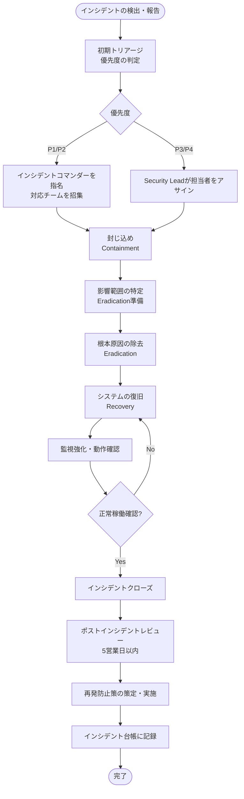

# セキュリティインシデント管理プロセス

## 目的

本文書は、セキュリティインシデントを迅速かつ効果的に検出・対応・復旧し、再発を防止するための管理プロセスを定める。インシデント発生時に関係者が迷わず行動できるよう、役割・手順・コミュニケーション方法を明確化することを目的とする。

## 適用範囲

- 情報漏洩・不正アクセス
- マルウェア感染・ランサムウェア攻撃
- サービス妨害（DDoS）
- 認証情報の漏洩・不正使用
- 内部不正・不審な内部操作
- 外部報告によるセキュリティ問題の発覚

---

## 1. インシデント分類

### 1.1 優先度レベル

| 優先度 | 名称 | 定義 | 対応開始目標 | 解決目標 |
|---|---|---|---|---|
| **P1** | 緊急 | 本番環境への深刻な影響、または機密データの大規模漏洩が確認・強く疑われる状態 | **即時（15分以内）** | **4時間以内** |
| **P2** | 高 | 本番環境への限定的な影響、または潜在的な機密データへのアクセス | **30分以内** | **24時間以内** |
| **P3** | 中 | 本番環境への影響は軽微、または影響範囲が限定的 | **4時間以内** | **72時間以内** |
| **P4** | 低 | セキュリティ上の懸念があるが、直接的な影響は確認されていない | **翌営業日** | **次のスプリント** |

### 1.2 インシデント例

| 優先度 | 具体例 |
|---|---|
| **P1** | 顧客データベースへの不正アクセス、本番環境での認証情報の侵害、ランサムウェアの感染 |
| **P2** | 退職者アカウントによる不審なアクセス、DDoSによるサービス低下、内部システムへの不正ログイン |
| **P3** | テスト環境への不正アクセス、フィッシングメールへの誤クリック（実害なし）、誤ったアクセス権限の付与 |
| **P4** | 脆弱なパスワードの使用、MFA未設定のアカウントの発見、セキュリティポリシー違反（悪意なし） |

---

## 2. インシデント対応フロー



### 2.1 フェーズ1: 検出（Detect）

インシデントの検出経路:
- 監視ツール・SIEMアラート
- ユーザー・顧客からの報告
- セキュリティ研究者からの報告
- 外部機関（JPCERT/CC等）からの通報
- チームメンバーによる発見

**検出時の初動:**
1. `#security-incidents` Slackチャンネルに報告する
2. 報告テンプレートに従って初期情報を記録する（後述）
3. Linearにインシデントチケットを起票する

### 2.2 フェーズ2: トリアージ（Triage）

**目的:** インシデントの優先度と影響範囲を迅速に評価する。

確認事項:
- 何が起きているか（事象の概要）
- いつから発生しているか（影響期間）
- どの範囲に影響があるか（影響ユーザー・システム）
- 個人情報・機密情報への影響があるか
- 現在も攻撃・漏洩が継続中か

**トリアージ基準:**

| 評価項目 | P1 | P2 | P3 | P4 |
|---|---|---|---|---|
| 機密データへのアクセス | 大規模/確定 | 限定的/疑い | 内部データのみ | なし |
| サービスへの影響 | 全停止/重大劣化 | 部分的影響 | 軽微 | なし |
| 攻撃の継続性 | 継続中 | 継続中の疑い | 停止済み | 停止済み |
| 規制上の報告義務 | あり（個人情報保護法等） | 評価中 | なし | なし |

### 2.3 フェーズ3: 封じ込め（Contain）

**目的:** インシデントの被害拡大を防ぐための即時措置を講じる。

**短期封じ込め策（影響範囲の制限）:**
- 侵害されたアカウントの無効化
- 不審なIPアドレスのブロック
- 侵害されたシステムのネットワーク分離
- APIキー・アクセストークンの失効

**長期封じ込め策（根本解決まで継続する暫定措置）:**
- 代替システムへの切り替え
- アクセス制御の一時的な厳格化
- 強化された監視の適用

**注意:** 証拠保全のため、侵害されたシステムを即座に削除・上書きしない。メモリダンプ、ログのコピーを取得してから対処する。

### 2.4 フェーズ4: 根本原因の除去（Eradicate）

**目的:** インシデントの原因を根本から除去する。

- マルウェアの完全除去
- 脆弱性の修正・パッチ適用
- バックドアの特定と削除
- 不正アカウント・不審なSSHキーの削除
- 設定ミスの修正

### 2.5 フェーズ5: 復旧（Recover）

**目的:** 影響を受けたシステム・サービスを安全な状態に復旧する。

1. クリーンな状態からシステムを再構築または復元する
2. バックアップからのデータ復元（必要な場合）
3. 監視を強化した状態で段階的にサービスを再開する
4. 復旧後24〜48時間は通常より強化した監視を継続する

### 2.6 フェーズ6: 学習（Learn）

**目的:** インシデントから学び、再発防止策を実施する。

- インシデントクローズから5営業日以内にポストインシデントレビューを実施する
- 根本原因分析（RCA）を行う
- 再発防止策を策定し、Linearチケットで追跡する
- 必要に応じて本文書を含むISMSドキュメントを更新する

---

## 3. 役割と責任

### 3.1 ロール定義

| ロール | 担当 | 主な責任 |
|---|---|---|
| **インシデントコマンダー（IC）** | Tech Lead（不在時: Security Lead） | インシデント対応全体の指揮・調整、優先度の最終判断、リソース確保 |
| **Security Lead** | Security担当（兼任可） | 技術的な調査・分析の主導、封じ込め・除去の技術判断、証拠保全 |
| **Communications Lead** | マネージャー or Tech Lead が兼任 | 社内・顧客・外部機関への通知の管理、情報の一元管理 |
| **対応メンバー** | 関連する開発者・インフラ担当 | ICおよびSecurity Leadの指示に従い技術的対応を実施 |
| **経営責任者** | CTO | P1インシデントの最終意思決定、規制当局への報告の最終承認 |

### 3.2 連絡先リスト

インシデント発生時の連絡先は、セキュアな社内ドキュメント（Notion 等）に別途管理し、定期的に更新する。

---

## 4. コミュニケーションテンプレート

### 4.1 初期報告（Slackへの投稿）

```
【セキュリティインシデント報告】
優先度: P[1/2/3/4]
報告者: @[名前]
発生日時: YYYY-MM-DD HH:MM (JST)
検出方法: [アラート/ユーザー報告/手動発見]

【概要】
（1〜2文でインシデントの概要を説明）

【現在の状況】
- 影響範囲: [システム名/ユーザー数]
- 継続性: [継続中/停止済み/不明]
- データへの影響: [あり/なし/調査中]

【初期対応状況】
（実施済みの対応があれば記載）

Linearチケット: [URL]
```

### 4.2 社内ステータス更新

P1/P2インシデント発生中は30〜60分ごとにステータス更新を `#security-incidents` に投稿する。

```
【インシデント更新 - HH:MM JST】
インシデントID: INC-YYYY-XXX
現在のステータス: 調査中 / 封じ込め中 / 復旧中

【最新状況】
（現在の状況を3〜5行で説明）

【実施済み対応】
- [対応内容1]
- [対応内容2]

【次のステップ】
- [次の対応内容]

【推定解決時刻】
YYYY-MM-DD HH:MM JST（変更の場合は随時更新）
```

### 4.3 顧客向け通知

**（Communications Leadが作成し、CTOが承認してから送信する）**

```
件名: [重要] セキュリティに関するお知らせ

[顧客名] 様

平素より [サービス名] をご利用いただきありがとうございます。

このたび、[発生日時] に [サービス/システム] において
セキュリティ上の事象が発生したことをお知らせいたします。

【発生した事象】
（事象の概要。技術的詳細は控えめに、顧客への影響を中心に）

【お客様への影響】
（影響の有無と範囲）

【弊社の対応】
（実施済みの対応と今後の対応予定）

【お客様にお願いしたいこと】
（パスワード変更などの推奨アクションがある場合）

本件に関するお問い合わせは、以下の窓口にご連絡ください。
Email: security@<ドメイン>

引き続き、セキュリティの向上に努めてまいります。

[署名]
```

### 4.4 規制当局への報告（個人情報保護法 第26条）

個人情報の漏洩が確認または強く疑われる場合、個人情報保護委員会への報告義務が発生する可能性がある。

- **速報（3〜5日以内）:** 概要報告
- **確報（30日以内）:** 詳細報告

報告要否の判断は、法務部門またはCTOが行う。

---

## 5. エスカレーションマトリクス

| 状況 | 通知先 | 通知方法 | 通知タイミング |
|---|---|---|---|
| P1インシデント発生 | IC、Security Lead、CTO、全Tech Lead | Slack + 電話/SMS | 即時 |
| P2インシデント発生 | IC、Security Lead、Tech Lead | Slack | 30分以内 |
| P3インシデント発生 | Security Lead、担当Tech Lead | Slack | 4時間以内 |
| P4インシデント発生 | Security Lead | Slack | 翌営業日 |
| 個人情報漏洩の疑い | CTO + 法務部門 | 電話 + Slack | 即時 |
| メディア・外部問い合わせ | CTO + Communications Lead | 電話 | 即時 |
| SLA超過（解決遅延） | CTO | Slack + 電話 | 遅延確認時 |

---

## 6. ポストインシデントレビューテンプレート

インシデントクローズから5営業日以内にポストインシデントレビューを実施し、Notionに記録する。

---

### ポストインシデントレビュー

**インシデントID:** INC-YYYY-XXX

**インシデント概要:** （1〜2文）

**優先度:** P[1/2/3/4]

**発生日時:** YYYY-MM-DD HH:MM JST

**解決日時:** YYYY-MM-DD HH:MM JST

**対応時間:** X時間Y分

**レビュー実施日:** YYYY-MM-DD

**参加者:** [名前リスト]

---

#### 6.1 インシデントタイムライン

| 日時 | 出来事 | 対応者 |
|---|---|---|
| HH:MM | インシデント検出 | |
| HH:MM | 初期報告・トリアージ開始 | |
| HH:MM | インシデントコマンダー指名 | |
| HH:MM | 封じ込め策実施 | |
| HH:MM | 根本原因特定 | |
| HH:MM | 根本原因除去 | |
| HH:MM | サービス復旧 | |
| HH:MM | インシデントクローズ宣言 | |

#### 6.2 根本原因分析（RCA）

**直接原因:** （インシデントを直接引き起こした技術的・人的要因）

**根本原因:** （なぜ直接原因が発生したか。5Whyなどを使用）

1. なぜ〜が発生したか？
2. なぜ〜だったか？
3. なぜ〜になっていたか？
4. （必要に応じて続ける）

#### 6.3 対応の評価

**うまくいったこと:**
- （検出が早かった、コミュニケーションが円滑だった等）

**改善が必要な点:**
- （検出に時間がかかった、手順が不明確だった等）

#### 6.4 影響の評価

| 影響項目 | 詳細 |
|---|---|
| 影響を受けたユーザー数 | |
| サービス停止時間 | |
| データへの影響 | |
| 金銭的損害（推定） | |
| 規制上の報告義務 | あり / なし |

#### 6.5 再発防止アクション

| No. | アクション内容 | 担当者 | 期限 | Linearチケット |
|---|---|---|---|---|
| 1 | | | | |
| 2 | | | | |
| 3 | | | | |

#### 6.6 プロセス改善提案

（本インシデント対応を通じて発見したプロセス・ドキュメントの改善点）

---

## 7. インシデント台帳テンプレート

すべてのインシデント（P1〜P4）はインシデント台帳（Notionで管理）に記録する。

| インシデントID | 発生日 | 優先度 | 概要 | 影響範囲 | 対応時間 | 根本原因 | 再発防止策 | ステータス |
|---|---|---|---|---|---|---|---|---|
| INC-2026-001 | 2026-MM-DD | P2 | | | | | | クローズ |

**インシデントIDの採番規則:** `INC-{年}-{連番3桁}` （例: INC-2026-001）

---

## 関連ドキュメント

- [クレデンシャル・シークレット管理ポリシー](./credential-management.md)
- [脆弱性管理プロセス](./vulnerability-management.md)
- [ログ管理ポリシー](./log-management.md)
- [変更管理プロセス](../qms/change-management.md)

---

*最終更新: 2026-06-12*
*文書番号: ISMS-INC-001*

## バージョン履歴

| バージョン | 日付 | 変更内容 | 担当 |
|---|---|---|---|
| 1.0.0 | 2026-06-12 | 初版作成 | - |
