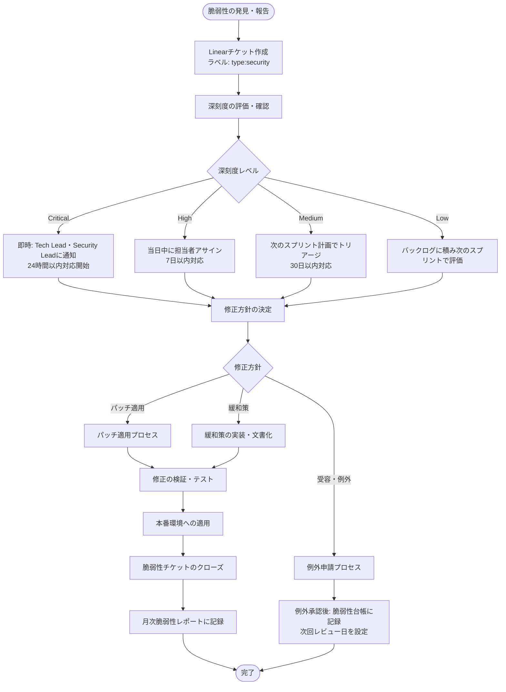

# 脆弱性管理プロセス

## 目的

本文書は、システムおよび利用ソフトウェアコンポーネントに存在するセキュリティ脆弱性を継続的に特定・評価・修正するための管理プロセスを定める。脆弱性の見落としや対応遅延を防ぎ、セキュリティリスクを許容可能な水準に維持することを目的とする。

## 適用範囲

- アプリケーションコードおよびその依存ライブラリ
- コンテナイメージおよびベースイメージ
- インフラストラクチャ（クラウドリソース、OS）
- GitHub リポジトリの設定・権限

---

## 1. 脆弱性の発見経路

### 1.1 自動スキャンツール

| ツール | 対象 | 実行タイミング | 担当 |
|---|---|---|---|
| **Dependabot** | npm/pip/Gemほか依存ライブラリ | コード変更時・週次スキャン | GitHub（自動） |
| **CodeQL** | アプリケーションコードの静的解析 | PR作成時・main ブランチへのマージ時 | GitHub Actions |
| **Trivy** | コンテナイメージ、ファイルシステム、IaC | PRのCI/CDパイプライン・本番デプロイ前 | GitHub Actions |
| **GitHub Secret Scanning** | シークレットの誤コミット | コミット・プッシュ時 | GitHub（自動） |

### 1.2 手動評価・外部評価

| 評価種別 | 頻度 | 実施者 |
|---|---|---|
| 内部セキュリティレビュー | PR単位（セキュリティへの影響が大きい変更） | Tech Lead / Security担当 |
| 定期的なペネトレーションテスト | 年1回以上、または重大な機能追加時 | 外部セキュリティベンダー |
| サードパーティセキュリティ監査 | 必要に応じて（コンプライアンス要件等） | 外部監査法人 |
| CTI（脅威インテリジェンス）モニタリング | 随時 | Security担当 |

### 1.3 外部報告

- セキュリティ研究者やユーザーからの報告窓口を設ける（security@<ドメイン>）
- バグバウンティプログラムの導入を検討する

---

## 2. 深刻度分類とSLA

### 2.1 深刻度の定義

脆弱性の深刻度は、CVSS v3.1 スコアおよびビジネスへの影響を総合的に考慮して分類する。

| 深刻度 | CVSSスコア目安 | 定義 | 対応SLA |
|---|---|---|---|
| **Critical（緊急）** | 9.0〜10.0 | 認証不要でリモートから悪用可能、または本番データへの直接アクセスにつながる脆弱性 | **24時間以内** |
| **High（高）** | 7.0〜8.9 | 認証後に悪用可能、または限定的なデータアクセスにつながる脆弱性 | **7日以内** |
| **Medium（中）** | 4.0〜6.9 | 悪用には特定条件が必要、または影響が限定的な脆弱性 | **30日以内** |
| **Low（低）** | 0.1〜3.9 | 悪用が困難、または影響が軽微な脆弱性 | **次のスプリント** |

### 2.2 SLAの起点

SLAのカウントは、脆弱性が公式に発見・報告された日時（Dependabot/CodeQLのアラート日時、または外部報告の受信日時）を起点とする。

### 2.3 深刻度の調整

ツールが自動で付与した深刻度は、以下の要因を考慮してチームが調整できる。

**深刻度を上げる要因:**
- 攻撃の実証コード（PoC）が公開されている
- 当該コンポーネントがインターネットに直接公開されている
- 機密データを処理するコンポーネントに影響する

**深刻度を下げる要因（緩和要因）:**
- 脆弱なコードパスが実際には使用されていない
- 多重の防衛的コントロールにより悪用が困難
- 影響を受けるコンポーネントがアクセス制限された内部システムのみ

---

## 3. 脆弱性アセスメントワークフロー



---

## 4. パッチ適用プロセス

### 4.1 依存ライブラリの更新（Dependabot）

**自動PRの処理フロー:**

1. DependabotがPRを自動作成する
2. CIパイプラインがテストを実行する
3. テストが全て通過した場合:
   - パッチバージョン更新: テスト通過後、Tech Lead が確認してマージ
   - マイナーバージョン更新: Tech Lead がChangelog確認後にマージ
   - メジャーバージョン更新: 担当エンジニアが影響評価後にマージ
4. テストが失敗した場合:
   - 担当エンジニアが原因を調査し、互換性を修正してからマージする

**重要: Dependabot Security Alerts の優先処理**

セキュリティ修正を含むPRはその他のPRより優先してマージし、SLA内に対応を完了する。

### 4.2 コンテナイメージの更新（Trivy）

```bash
# ローカルでのコンテナスキャン（開発時）
trivy image <image-name>:<tag>

# CIパイプラインでのスキャン（GitHub Actions）
- name: コンテナ脆弱性スキャン
  uses: aquasecurity/trivy-action@master
  with:
    image-ref: ${{ env.IMAGE_NAME }}:${{ github.sha }}
    format: 'sarif'
    output: 'trivy-results.sarif'
    severity: 'CRITICAL,HIGH'
    exit-code: '1'  # Critical/High が存在する場合はCIを失敗させる
```

ベースイメージの更新手順:
1. 更新されたベースイメージでビルドする
2. Trivyスキャンを実行し、Critical/High が解消されたことを確認する
3. 機能テストを実行する
4. 変更をPRで提出し、レビュー後にマージする

### 4.3 緊急パッチの適用

Critical 脆弱性への緊急パッチは、通常のリリースサイクルを迂回して適用できる。

1. Tech Lead が緊急変更を宣言する
2. 変更を最小限にし、セキュリティ修正のみを含むホットフィックスブランチを作成する
3. 最低1名のレビュアーによる迅速なレビューを実施する
4. テストを実行し、通過を確認する
5. 本番環境に適用し、動作確認する
6. 事後にインシデントレポートを作成する

---

## 5. 受容・例外プロセス

### 5.1 例外申請が認められる条件

以下の場合に限り、SLA内での修正が困難な脆弱性に対して例外を申請できる。

- **修正不可能:** 修正パッチがまだリリースされていない（0-day）
- **互換性の問題:** 修正を適用すると重大な機能障害が発生する
- **コスト対効果:** リスクが低く、修正コストが大幅に上回る

### 5.2 例外申請プロセス

1. **申請:** 担当エンジニアが以下の情報を含む例外申請チケットを起票する
   - 脆弱性の詳細（CVE番号等）
   - 修正できない理由
   - リスクの定量的評価
   - 暫定的な緩和策
   - 例外の有効期限（最長90日）

2. **承認:** Tech Lead および Security Lead が承認する
   - Critical/High 脆弱性の例外申請は CTO の承認も必要

3. **記録:** 承認された例外は脆弱性台帳（後述）に記録する

4. **再評価:** 有効期限到来時に再評価を実施する

### 5.3 脆弱性台帳

例外または緩和策で管理している脆弱性を以下の台帳で追跡する。

| CVE/ID | 対象コンポーネント | 深刻度 | 発見日 | 修正方針 | 緩和策 | 次回レビュー日 | 担当者 |
|---|---|---|---|---|---|---|---|
| CVE-2026-XXXX | npm:example-lib@1.2.3 | High | 2026-05-01 | パッチ待ち | 外部アクセスをIPで制限 | 2026-07-01 | @alice |

---

## 6. 月次脆弱性レポートテンプレート

月次レポートはNotionに記録し、Tech Lead、Security Lead、CTOに共有する。

---

### 脆弱性月次レポート

**対象期間:** YYYY年MM月

**作成者:** [名前]

**作成日:** YYYY-MM-DD

---

#### 6.1 サマリ

| 指標 | 今月 | 先月 | 傾向 |
|---|---|---|---|
| 新規発見（Critical） | 件 | 件 | ↑/↓/→ |
| 新規発見（High） | 件 | 件 | ↑/↓/→ |
| 新規発見（Medium） | 件 | 件 | ↑/↓/→ |
| 新規発見（Low） | 件 | 件 | ↑/↓/→ |
| SLA遵守率（Critical: 24h） | % | % | |
| SLA遵守率（High: 7d） | % | % | |
| 未解決脆弱性（Critical） | 件 | 件 | |
| 未解決脆弱性（High） | 件 | 件 | |

#### 6.2 対応済み脆弱性

| CVE/ID | 深刻度 | 発見日 | 対応完了日 | SLA遵守 | 対応内容 |
|---|---|---|---|---|---|
| | | | | Yes/No | |

#### 6.3 未解決脆弱性（例外・緩和策中）

| CVE/ID | 深刻度 | 発見日 | 状況 | 緩和策 | 次回レビュー日 |
|---|---|---|---|---|---|
| | | | | | |

#### 6.4 今月の主要な対応事項

（重要な修正や対応について箇条書きで記述）

#### 6.5 翌月の計画

（次月に対応予定の脆弱性や改善活動）

#### 6.6 リスク評価

（現在の脆弱性対応状況に関するリスク評価と推奨アクション）

---

## 関連ドキュメント

- [クレデンシャル・シークレット管理ポリシー](./credential-management.md)
- [インシデント管理プロセス](./incident-management.md)
- [ログ管理ポリシー](./log-management.md)
- [変更管理プロセス](../qms/change-management.md)

---

*最終更新: 2026-06-12*
*文書番号: ISMS-VULN-001*

## バージョン履歴

| バージョン | 日付 | 変更内容 | 担当 |
|---|---|---|---|
| 1.0.0 | 2026-06-12 | 初版作成 | - |
