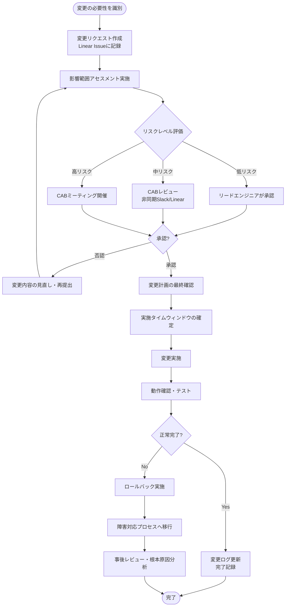
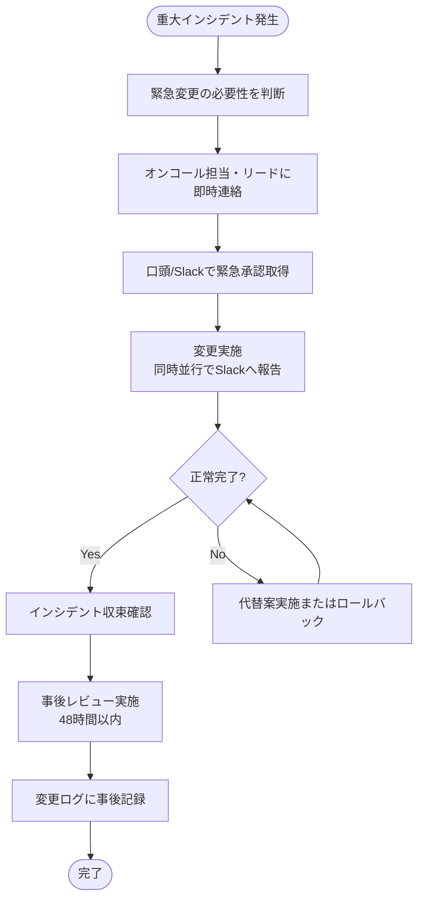

# 変更管理プロセス

## 目的

本文書は、システムおよびプロセスに対する変更を、リスクを最小化しながら確実に管理・実施するための手順を定める。変更の計画、評価、承認、実施、および検証を体系的に行うことで、サービスの安定性と品質を維持する。

## 適用範囲

本プロセスは以下の変更に適用する:
- 本番環境へのコード・設定の変更
- インフラストラクチャの変更（クラウドリソース、ネットワーク等）
- 外部サービスとの連携設定の変更
- セキュリティポリシーの変更
- データベーススキーマ・データの変更

---

## 1. 変更の種類

### 1.1 緊急変更 (Emergency Change)

**定義:** 本番環境における重大な障害（P0/P1インシデント）を解決するために、通常の承認プロセスを省略して即時対応が必要な変更。

**特徴:**
- サービスの停止または重大な機能障害が発生している
- 事後承認が許容される
- 変更後に事後レビューを必ず実施する

**例:**
- セキュリティ脆弱性の緊急パッチ適用
- 本番環境のデータ破損を引き起こすバグの修正
- サービス全停止を引き起こす設定ミスの修正

---

### 1.2 標準変更 (Standard Change)

**定義:** 事前に承認されたプロセスが存在し、リスクが低く、繰り返し実施される変更。

**特徴:**
- 手順が文書化・標準化されている
- 個別の承認は不要（プロセス自体が承認済み）
- 変更ログへの記録は必要

**例:**
- 定期的な依存ライブラリのパッチバージョンアップ
- 確立されたデプロイパイプラインによるリリース
- 既存の監視アラートの閾値調整

---

### 1.3 通常変更 (Normal Change)

**定義:** 標準変更でも緊急変更でもない変更。変更諮問委員会（CAB）またはリードによる事前承認が必要。

**特徴:**
- リスク評価が必要
- 変更計画の作成が必要
- ロールバック計画が必要
- 承認を得てから実施する

**例:**
- 新機能のリリース
- アーキテクチャの変更
- インフラの大規模な構成変更
- 外部サービスの切り替え

---

## 2. 変更リクエストワークフロー

### 2.1 通常変更のワークフロー



### 2.2 緊急変更のワークフロー



---

## 3. 変更リクエストフォーマット

変更リクエストはLinear Issueとして作成し、以下の情報を記載する:

```
タイトル: [変更種別] 変更内容の概要

## 変更概要
何を変更するか、1〜2文で説明。

## 変更の理由
なぜこの変更が必要か。ビジネス上の理由、技術的な理由を記載。

## 変更内容の詳細
具体的に何をどのように変更するか。

## 影響範囲
- 影響を受けるサービス・コンポーネント:
- 影響を受けるユーザー:
- ダウンタイムの有無:

## リスクレベル
[ ] 低（サービスへの影響がほぼない）
[ ] 中（限定的な影響の可能性）
[ ] 高（広範囲への影響の可能性）

## 実施計画
1. 手順1
2. 手順2
3. ...

## ロールバック計画
問題が発生した場合の復旧手順。

## テスト・確認計画
変更が正常に完了したことをどう確認するか。

## 実施予定日時
YYYY-MM-DD HH:MM (JST)

## 担当者
実施者: @username
承認者: @username
```

---

## 4. 影響評価テンプレート

変更を実施する前に、以下の観点で影響を評価する。

### 4.1 技術的影響

| 評価項目 | 影響の有無 | 詳細・対応策 |
|---|---|---|
| サービスの可用性 | Yes / No | |
| パフォーマンスへの影響 | Yes / No | |
| データの整合性 | Yes / No | |
| セキュリティへの影響 | Yes / No | |
| 他コンポーネントへの依存 | Yes / No | |
| 外部サービスへの影響 | Yes / No | |
| 監視・アラートへの影響 | Yes / No | |

### 4.2 ビジネス影響

| 評価項目 | 影響の有無 | 詳細・対応策 |
|---|---|---|
| エンドユーザーへの影響 | Yes / No | |
| SLA/SLOへの影響 | Yes / No | |
| コンプライアンスへの影響 | Yes / No | |
| 課金・請求への影響 | Yes / No | |

### 4.3 リスクマトリクス

| 影響度 \\ 発生可能性 | 低 | 中 | 高 |
|---|---|---|---|
| 高 | 中リスク | 高リスク | 高リスク |
| 中 | 低リスク | 中リスク | 高リスク |
| 低 | 低リスク | 低リスク | 中リスク |

---

## 5. 変更諮問委員会 (CAB)

### 5.1 CABの構成（小規模チーム向け軽量構成）

小規模チームにおけるCABは、重量級の委員会ではなく、適切なレビュアーによる非同期または簡易同期レビューを基本とする。

| ロール | 担当 | 責務 |
|---|---|---|
| CABチェア | テックリード/エンジニアリングマネージャー | 変更の最終承認、プロセス維持 |
| 技術レビュアー | 担当サービスのリードエンジニア | 技術的実現可能性・リスクの評価 |
| 関係者レビュアー | 影響を受けるサービスの担当者 | 影響範囲の評価 |

### 5.2 CABレビューの方法

**非同期レビュー（低〜中リスク変更）:**
1. 変更リクエストをLinear Issueに作成する
2. 関係者をメンションして通知する
3. 指定した期日（通常24〜48時間）までにコメントで承認または懸念を表明する
4. 懸念がなければCABチェアが承認する

**同期レビュー（高リスク変更）:**
1. CABチェアが30分のミーティングを設定する
2. 変更リクエストを事前に共有する
3. ミーティングでリスクと対応策を議論する
4. 合意のうえで承認または差し戻しを決定する

### 5.3 CABの開催頻度

- 定期CABミーティング: 週1回（必要な場合のみ、アジェンダがなければキャンセル可）
- 緊急CAB: 必要に応じて随時（Slackで招集）

---

## 6. ロールバック手順

### 6.1 ロールバック判断基準

以下のいずれかに該当する場合、ロールバックを実施する:

- エラーレートが変更前の2倍以上に上昇した
- 重要なKPIが著しく悪化した
- 計画したテストが合格しない
- 予期しない依存関係の問題が発生した
- 変更完了予定時間を30分以上超過した

### 6.2 ロールバック判断フロー

```
問題を検知
    ↓
影響の範囲・深刻度を5分で評価
    ↓
ロールバック基準に該当するか判断
    ↓
    YES → 即時ロールバック実施
    NO  → 修正継続（タイムリミット設定）
            ↓
         タイムリミット到達
            ↓
         ロールバック実施
```

### 6.3 一般的なロールバック手順

**コード変更の場合:**
1. デプロイパイプラインの「ロールバック」アクションを実行する
2. または前のバージョンのコンテナイメージ/リリースタグをデプロイする
3. ロールバック完了後、動作確認を行う
4. インシデント対応ログに記録する

**設定変更の場合:**
1. 変更前の設定値をバックアップから復元する
2. 設定の反映（再起動が必要な場合は実施）
3. 動作確認を行う

**データベース変更の場合:**
1. 事前に取得したバックアップから復元する
2. または逆方向のマイグレーションスクリプトを実行する
3. データの整合性を確認する
4. アプリケーションの動作確認を行う

---

## 7. 変更ログの管理

### 7.1 記録すべき情報

すべての変更（標準変更を含む）は変更ログに記録する。

**記録項目:**
- 変更ID（Linear Issue番号）
- 変更種別（緊急/標準/通常）
- 変更内容の概要
- 実施日時
- 実施者
- 承認者
- 実施結果（成功/ロールバック/失敗）
- 所見・備考

### 7.2 変更ログの保存場所

- **プライマリ:** Linear Issueのラベル「change-log」でフィルタリング可能な状態を維持する
- **サマリ:** 月次で変更サマリをNotionまたはConfluenceに記録する

### 7.3 変更ログのレビュー

- 週次: リードエンジニアが先週の変更を確認する
- 月次: マネージャーが変更傾向を確認し、改善点を特定する
- 四半期: 変更プロセス自体の有効性を振り返る（レトロスペクティブで実施）

---

## 8. メトリクスと継続的改善

追跡すべき変更管理メトリクス:
- 変更成功率（ロールバックなしで完了した変更の割合）
- 変更によるインシデント発生率
- 変更リードタイム（リクエストから実施完了まで）
- 緊急変更の件数（増加傾向は問題のシグナル）

---

## 関連ドキュメント

- [設計管理プロセス](./design-management.md)
- [リリース管理プロセス](./release-management.md)
- [継続的改善プロセス](./continuous-improvement.md)

---

*最終更新: 2026-06-12*
*文書番号: QMS-CHG-001*
