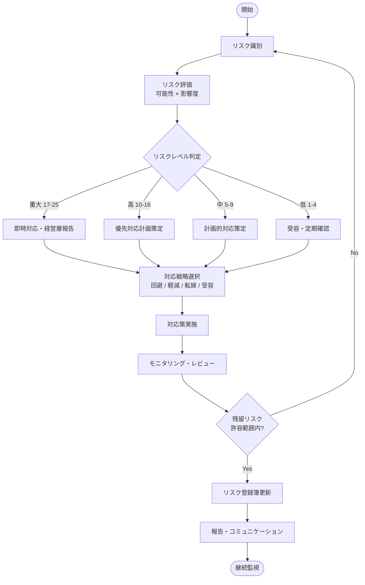
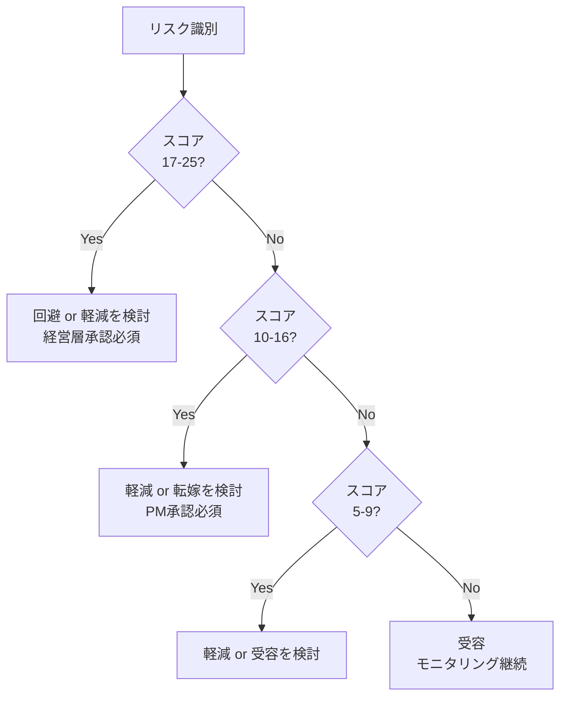

# リスク管理手順書

**バージョン**: 1.0.0
**作成日**: 2026-06-12
**最終更新**: 2026-06-12
**準拠規格**: ISO 27001:2022, ISO 9001:2015

---

## 1. リスク管理プロセス概要

本手順書は、プロジェクトにおけるリスクを体系的に識別・評価・対応・モニタリングするためのプロセスを定義します。

### 1.1 プロセスフロー

### 1.2 役割と責任

| 役割 | 責任 |
|---|---|
| プロジェクトマネージャー | リスク管理プロセス全体の統括 |
| リスクオーナー | 担当リスクの対応計画策定・実施 |
| 開発チームリード | 技術リスクの識別・評価 |
| セキュリティ担当 | セキュリティリスクの専門的評価 |
| 経営層 | 重大・高リスクの承認・意思決定 |

---

## 2. リスク識別方法

### 2.1 識別のタイミング

- プロジェクト開始時（キックオフ）
- スプリント計画時（各スプリント）
- 重大な変更発生時（随時）
- 月次リスクレビュー時

### 2.2 識別手法

- **ブレインストーミング**: チームでのワークショップ
- **チェックリストレビュー**: 過去のプロジェクト事例に基づくリスト確認
- **専門家ヒアリング**: ドメイン専門家へのインタビュー
- **SWOT分析**: 強み・弱み・機会・脅威の分析
- **インシデント記録のレビュー**: 過去の障害・問題事例の分析

### 2.3 技術リスク

技術的な実装・運用に関するリスクカテゴリです。

#### セキュリティリスク

| リスク例 | 説明 |
|---|---|
| 不正アクセス | 認証・認可の不備による不正操作 |
| データ漏洩 | 機密情報・個人情報の外部流出 |
| SQLインジェクション / XSS | アプリケーション脆弱性の悪用 |
| 依存ライブラリの脆弱性 | サードパーティ製品のセキュリティ問題 |
| 秘密情報の露出 | APIキー・認証情報のリポジトリへの混入 |

#### パフォーマンスリスク

| リスク例 | 説明 |
|---|---|
| レスポンス劣化 | 負荷増大によるレスポンスタイムの悪化 |
| データベースボトルネック | クエリ最適化不足・インデックス欠如 |
| スケーリング不足 | トラフィック急増への対応不備 |
| メモリリーク | 長期運用時のリソース枯渇 |

#### 可用性リスク

| リスク例 | 説明 |
|---|---|
| 単一障害点（SPOF） | 冗長化不足による全体停止リスク |
| データ損失 | バックアップ・リストア手順の不備 |
| 外部依存サービスの停止 | 連携APIやクラウドサービスの障害 |
| デプロイ失敗 | リリース手順の不備による本番障害 |

### 2.4 プロジェクトリスク

プロジェクト遂行に関するリスクカテゴリです。

#### スケジュールリスク

| リスク例 | 説明 |
|---|---|
| 要件の不明確さ | 仕様変更・追加による工数増大 |
| 見積もり精度の低さ | 実装難易度の過小評価 |
| テスト工程の遅延 | バグ多発・品質不足による手戻り |
| リリース基準未達 | 品質基準を満たせない状態でのリリース判断 |

#### リソースリスク

| リスク例 | 説明 |
|---|---|
| キーメンバーの離脱 | 重要技術者の退職・異動 |
| スキル不足 | 必要な技術に習熟したメンバーの不在 |
| 作業過負荷 | チームメンバーへの過度な負荷集中 |

#### 依存リスク

| リスク例 | 説明 |
|---|---|
| 外部チームへの依存 | 他チームの成果物・API提供の遅延 |
| サードパーティ製品 | 採用ライブラリ・SaaSの機能変更・廃止 |
| 承認プロセスの遅延 | 意思決定・承認フローの遅延 |

### 2.5 ビジネスリスク

事業継続・コンプライアンスに関するリスクカテゴリです。

#### 規制・法令リスク

| リスク例 | 説明 |
|---|---|
| 個人情報保護法違反 | GDPR・個情法への対応不備 |
| ライセンス違反 | OSSライセンスの不適切な使用 |
| 業界規制への未対応 | 金融・医療等の規制要件の変更 |

#### 競合・市場リスク

| リスク例 | 説明 |
|---|---|
| 市場ニーズの変化 | 開発中に市場要件が変化する |
| 競合サービスの台頭 | 類似機能を持つ競合の登場 |
| 技術トレンドの変化 | 採用技術スタックの陳腐化 |

---

## 3. リスク評価方法

### 3.1 評価スケール

リスクスコアは**可能性**と**影響度**の積で算出します。

**リスクスコア = 可能性 × 影響度**

#### 可能性（Likelihood）

| スコア | レベル | 定義 |
|---|---|---|
| 1 | まれ | 発生確率が非常に低い（年1回未満） |
| 2 | 低い | 発生する可能性は低い（年1-2回程度） |
| 3 | 中程度 | 発生する可能性がある（数ヶ月に1回） |
| 4 | 高い | 発生する可能性が高い（月1回程度） |
| 5 | ほぼ確実 | 高い確率で発生する（週1回以上） |

#### 影響度（Impact）

| スコア | レベル | 定義 |
|---|---|---|
| 1 | 無視できる | ビジネスへの影響がほとんどない |
| 2 | 軽微 | 軽微な遅延やコスト増（対応工数: 1日以内） |
| 3 | 中程度 | 一定の遅延・コスト増（対応工数: 1週間以内） |
| 4 | 重大 | 重大な遅延・コスト増・信頼失墜（対応工数: 1ヶ月以内） |
| 5 | 壊滅的 | プロジェクト中止・事業継続困難・法的問題 |

### 3.2 リスクマトリクス

|  | 影響1 | 影響2 | 影響3 | 影響4 | 影響5 |
|---|---|---|---|---|---|
| **可能性5** | 5(中) | 10(高) | 15(高) | 20(重大) | 25(重大) |
| **可能性4** | 4(低) | 8(中) | 12(高) | 16(高) | 20(重大) |
| **可能性3** | 3(低) | 6(中) | 9(中) | 12(高) | 15(高) |
| **可能性2** | 2(低) | 4(低) | 6(中) | 8(中) | 10(高) |
| **可能性1** | 1(低) | 2(低) | 3(低) | 4(低) | 5(中) |

### 3.3 リスクレベルの定義

| リスクレベル | スコア範囲 | 色 | 対応優先度 |
|---|---|---|---|
| 低 | 1-4 | 緑 | 低（受容または定期確認） |
| 中 | 5-9 | 黄 | 中（計画的対応） |
| 高 | 10-16 | 橙 | 高（優先対応） |
| 重大 | 17-25 | 赤 | 最高（即時対応・エスカレーション必須） |

---

## 4. リスク対応戦略

### 4.1 対応戦略の種類

#### 回避（Avoidance）

リスクを引き起こす活動や条件を排除し、リスク自体を発生させない戦略。

- 適用条件: リスクスコアが高く、回避による機会損失が許容範囲内の場合
- 例: リスクのある機能の開発中止、代替技術への切り替え

#### 軽減（Mitigation）

リスクの可能性または影響度を低下させる対策を実施する戦略。

- 適用条件: リスクを完全に排除できないが、影響を抑制できる場合
- 例: コードレビュー強化、自動テストの導入、冗長化設計、定期的な脆弱性スキャン

#### 転嫁（Transfer）

リスクの影響を第三者（保険、外部委託等）に移転する戦略。

- 適用条件: 外部専門家や保険によりリスク対応コストを最適化できる場合
- 例: クラウドサービスへの移行、サイバー保険の加入、専門ベンダーへの委託

#### 受容（Acceptance）

リスクを認識した上で、対応コストが便益を上回るため、意図的に受け入れる戦略。

- 適用条件: リスクスコアが低く、対応コストがリスク損失を超える場合
- 例: 低頻度・低影響のリスクに対するコンティンジェンシー予算の確保

### 4.2 対応戦略の選択基準

---

## 5. リスクモニタリング

### 5.1 月次リスクレビュー

毎月第1営業日に実施するリスク管理会議。

**参加者**: プロジェクトマネージャー、各リスクオーナー、セキュリティ担当

**アジェンダ**:
1. 前月の対応状況確認（30分）
2. 新規リスクの識別・評価（20分）
3. 既存リスクのスコア再評価（20分）
4. 対応計画の見直し・承認（20分）
5. リスク登録簿の更新確認（10分）

**成果物**: 更新済みリスク登録簿、月次リスクサマリーレポート

### 5.2 スプリントでのリスク確認

各スプリントのプランニングおよびレトロスペクティブで実施。

**スプリントプランニング時**:
- 当スプリントに関連する既存リスクの確認
- 新規発生リスクの識別
- リスク対応タスクのバックログ追加

**レトロスペクティブ時**:
- スプリント中に顕在化したリスクの振り返り
- 対応策の有効性評価
- 次スプリントへの引き継ぎ事項整理

### 5.3 継続監視項目

| 監視項目 | 頻度 | 担当 |
|---|---|---|
| セキュリティ脆弱性スキャン | 週次 | セキュリティ担当 |
| 依存ライブラリの更新確認 | 週次 | 開発チームリード |
| システム稼働状況・アラート | 随時（自動監視） | インフラ担当 |
| 外部規制・法令の変更確認 | 月次 | 法務・コンプライアンス担当 |
| プロジェクト進捗と工数乖離 | 週次 | プロジェクトマネージャー |

---

## 6. リスク報告

### 6.1 経営層への四半期報告

四半期ごとに経営層向けリスクレポートを作成・報告します。

**報告タイミング**: 各四半期末（3月、6月、9月、12月）

**報告内容**:

1. **エグゼクティブサマリー**
   - 重大・高リスクの件数と推移
   - 前四半期比での改善・悪化状況
   - 主要リスクトップ5と対応状況

2. **リスク全体統計**
   - レベル別リスク件数（重大/高/中/低）
   - カテゴリ別リスク分布
   - 解消・新規発生リスク数

3. **対応状況レポート**
   - 対応中リスクの進捗
   - 期限超過リスクの原因と対策
   - リソース・予算の実績報告

4. **次四半期の重点リスク**
   - 注視すべきリスクの特定
   - 追加投資・対応が必要なリスク
   - 外部環境変化によるリスク予測

### 6.2 エスカレーション基準

以下の条件を満たした場合、即時に経営層へエスカレーションします。

| 条件 | エスカレーション先 | 期限 |
|---|---|---|
| 新規重大リスク（スコア17以上）の識別 | プロジェクトオーナー・経営層 | 24時間以内 |
| 既存リスクのスコアが高→重大へ上昇 | プロジェクトオーナー | 48時間以内 |
| 対応計画が期限を2週間以上超過 | プロジェクトマネージャー | 1週間以内 |
| セキュリティインシデントの発生 | CISO・経営層 | 即時 |
| 個人情報漏洩の可能性 | CISO・法務・経営層 | 即時 |

### 6.3 リスク登録簿の管理

- リスク登録簿は [risk-register-template.md](./risk-register-template.md) を使用する。
- リスクIDは `RISK-[YYYY]-[連番3桁]` の形式で採番する（例: RISK-2026-001）。
- 更新は月次レビュー後に必ず実施し、変更履歴をコミットメッセージに記録する。
- 解消済みリスクはステータスを「解消済」に変更し、アーカイブとして記録を保持する。

---

## 改訂履歴

| バージョン | 日付 | 変更内容 | 作成者 |
|---|---|---|---|
| 1.0.0 | 2026-06-12 | 初版作成 | Masato Miyaichi |
